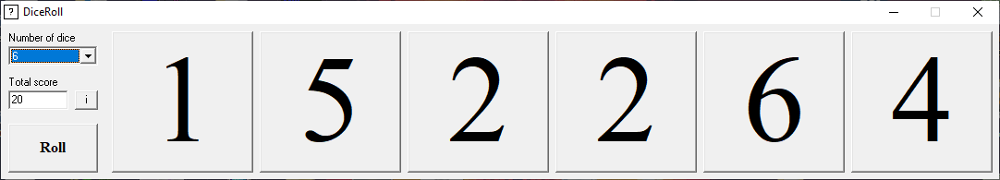

# DiceRoll
DiceRoll is a simple program that rolls dice for you. You can roll between one to six dice simultaneously. 

Program features:

-	Rolls dice and siplays result in numeric format
-	Select from one to six dice to roll simultaneously
-	Shows the total score for all dice
-	It is a free program licensed under MIT terms. Feel free to use the code as you like. 
